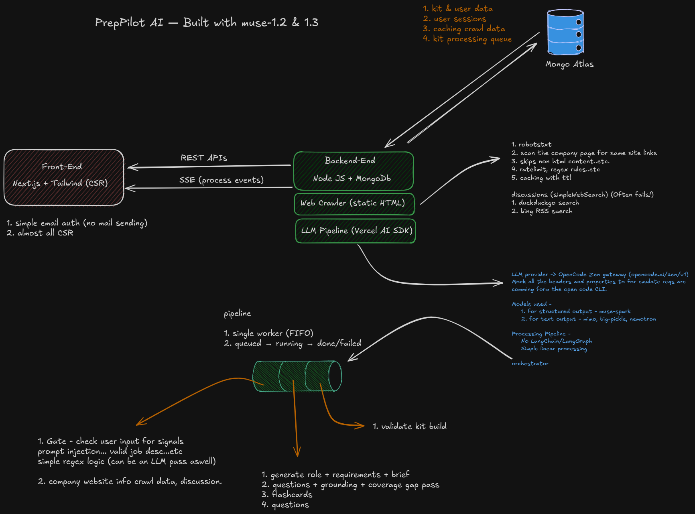

# PrepPilot AI — The AI Interview Prep Kit

Paste a job description + company URL, get a structured interview prep kit: company brief, role requirements, practice questions, flashcards, day-by-day schedule.

Monorepo: Next.js (TypeScript + Tailwind) frontend, Express (TypeScript) backend.

## Architecture -




```bash
.
├── frontend/   # Next.js 16 App Router — thin pages delegate to src/features/**
└── backend/    # Express 5 API + kit generation pipeline
```

## Dev

```bash
cd frontend && npm install && npm run dev   # http://localhost:3000
cd backend && npm install && npm run dev    # http://localhost:5000
```

Backend needs `.env` (see `backend/.env.example`): `MONGODB_URI`, `SESSION_SECRET`, `OPENCODE_API_KEY` for LLM access.

## Docs

- `backend/README.md` — API layout, request flow, worker, env, scripts.
- `backend/src/pipeline/README.md` — generation steps + LLM failover.
- `backend/src/crawler/README.md` — company-site crawler.
